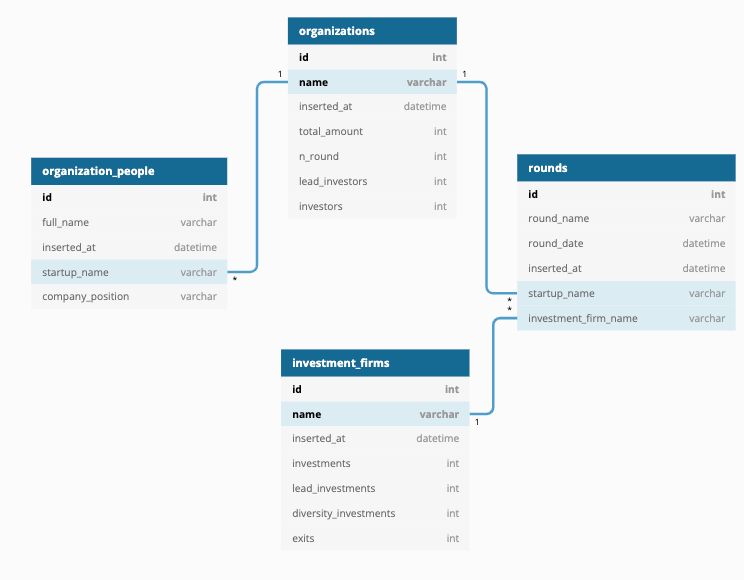

<h1 align="center">PoC Crunchbase Startup Info</h1>

<h2 align="center">Python Scraper + SQLite Persistence + Deployed App Startup Monitoring</h2>

<div align="center">

[]()

</div>


## 📝 Table of Contents

- [Deployed App](#app)
- [About the scraper](#about)
- [Getting Started](#getting_started)

## 🧐 Deployed App<a name = "app"></a>

This App is a monitoring platform. The dashboards join the scraper info with public datasets, ficticial financial data, and social media.

It constitutes a 360º view of the porfolio performance and also the whole ecosystem tracking, with social media feeds, market data and a little valuation forecasting module.

Link to Deployed App: [Startup Monitoring App](https://carlosvecinatebar.shinyapps.io/poc_crunchbase_startups)


## 🧐 About the scraper<a name = "about"></a>

This project is created aiming explorate startup ecosystem data, and modeling in a simple SQLite data base.

The first component is the scraper itself. We are collecting data about `Startups`, `People` working on them, `Investment Firms` and `Rounds`.

The simplified data model follows the above diagram:



## 🏁 Getting Started <a name = "getting_started"></a>

These instructions will get you a copy of the project up and running on your local machine.


### Installing

Be sure about having Poetry installed in your machine.

```
make
```

To run the query demo:

```
poetry run python scripts/demo
```

